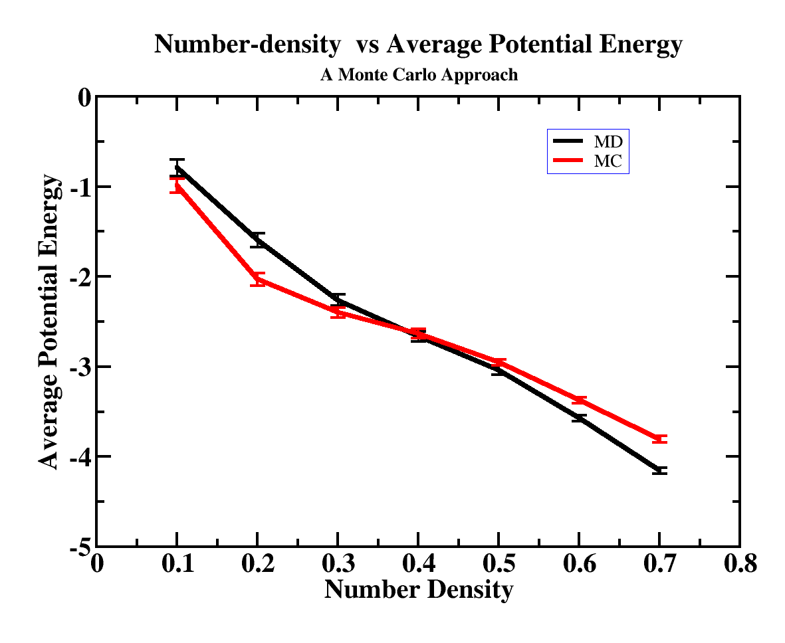

## Molecular Dynamics simulations using Scilab
Scilab is an open source alternative to MATLAB. Molecular simulation algorithms were implemented on this platform using two approaches: Molecular Dynamics and Monte Carlo. 

### What is Scilab?
Scilab is an open-source software platform for numerical computation. It is a high-level programming language similar to MATLAB and shares most of the features from there, and better, being a free alternative. 

### Approaches to Molecular Simulations
- Molecular Dynamics (MD): The MD simulation method uses Newton's laws of motion to model the time evolution of a system of particles. This approach calculates the forces and interactions between atoms or molecules and integrates the equations of motion over time to predict their behavior.
- Monte Carlo (MC): The MC method is a statistical technique that relies on random sampling to estimate properties of a system. It’s often used to study equilibrium properties, such as free energy, entropy, and phase transitions, in molecular simulations.

### About the algorithms
This repo contains the repo for simulating a gaseous system reaching equilibirum through the above mentioned approaches - MD and MC. `md_N100.sci` corresponds to obtaining the trajectories of a system containing 100 atoms, using MD, and similarly, `mc_n100.sci` corresponding to the MC approach, with 100 atoms. 

### Some notes:
MC is extremely computationally expensive. This code was also run for 700 atoms with the same idea which continued for around 220 days!^[System details: The simulation was performed on an Intel i7-12700 (12th Gen) processor with 20 cores.]
- The above systems are best visualized with VMD. 

